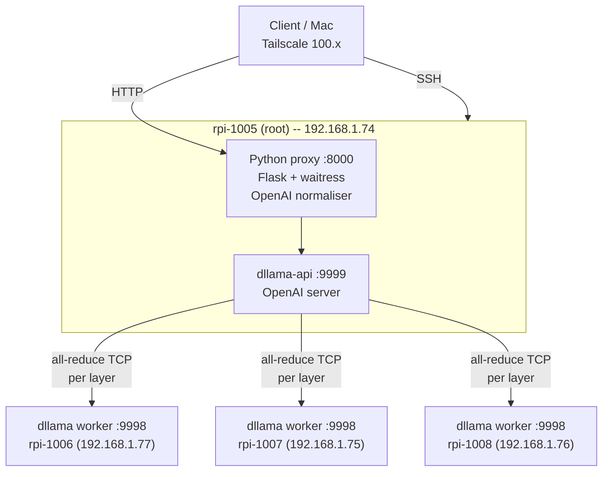
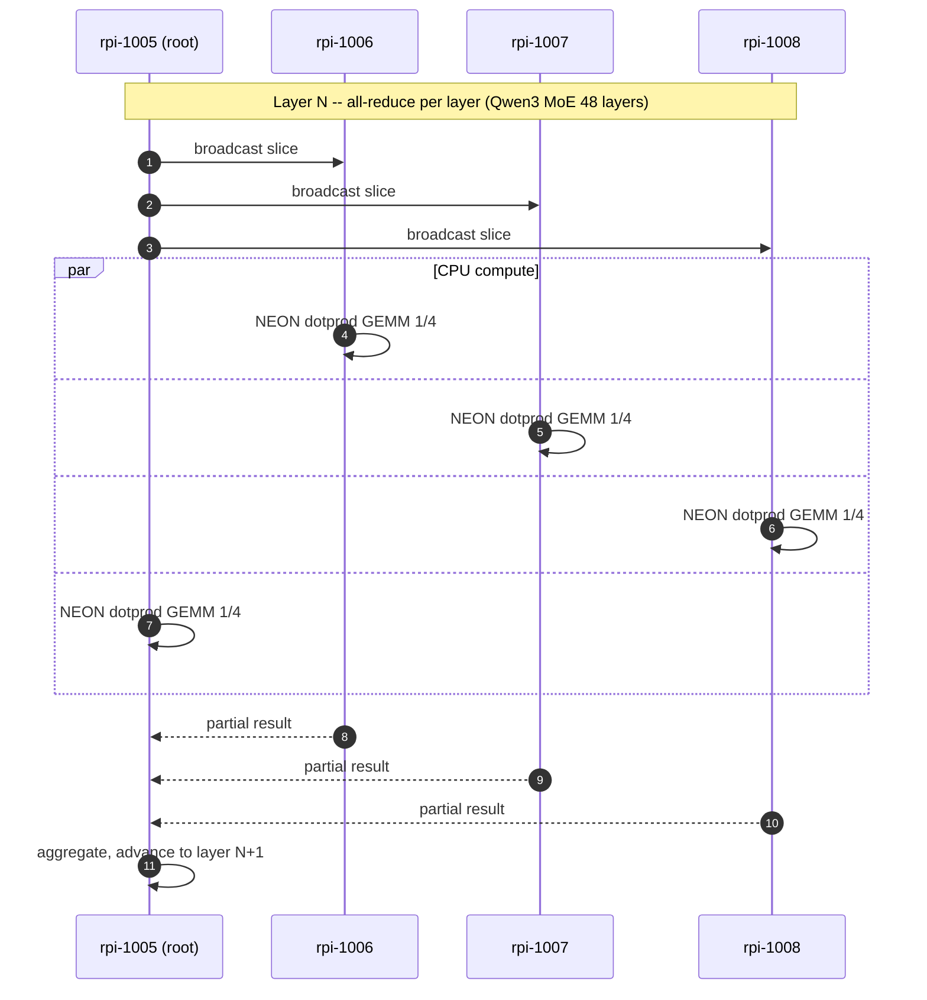
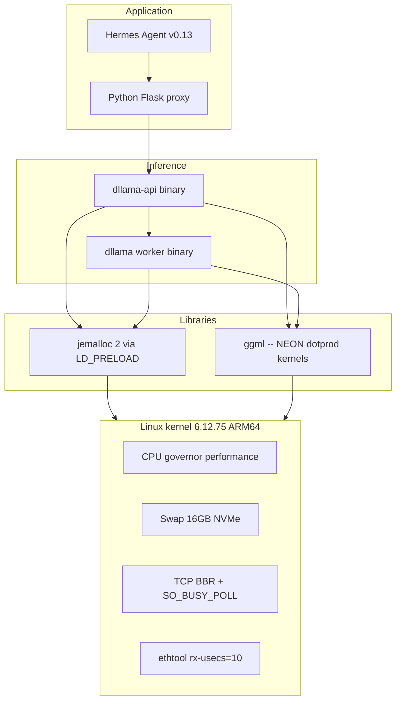

# Distributed LLM Inference Cluster — 4x Raspberry Pi 5

Production-grade distributed inference cluster running **Qwen3-30B-A3B (Mixture of Experts)** at **14.449 tokens/second sustained** on 4x Raspberry Pi 5 16GB. Built on a patched fork of `distributed-llama` v0.16.5 with **twelve source-level fixes plus persistent runtime kernel tweaks**, exposed as an OpenAI-compatible HTTP API, and integrated with Hermes Agent for autonomous workflows.

This repository contains the complete configuration, patches, systemd units, deployment scripts and technical report needed to reproduce the setup on any 4-node ARM64 Linux cluster.

---

## Final results

| Metric                     | Value                       |
| -------------------------- | --------------------------- |
| Throughput (sustained)     | **14.449 tok/s** mean (n=20)|
| Throughput (peak measured) | 14.557 tok/s                |
| Time-to-first-token (TTFT) | 557 ms                      |
| Standard deviation         | 0.086 tok/s (CV 0.60%)      |
| 95% confidence interval    | +/- 0.038 tok/s             |
| Memory per node (root)     | 12 / 16 GB                  |
| Memory per node (worker)   | 6.3 / 16 GB                 |
| Sustained CPU temperature  | 64-74 deg C (active cooler) |
| Public-benchmark ceiling   | 13.04 tok/s (b4rtaz #255)   |
| **Improvement vs ceiling** | **+10.81%**                 |

Full evolution across the optimisation pipeline:

```
Baseline (Llama 3.1 8B dense, vanilla):       5.70 tok/s
+ OS tuning (governor, swap NVMe, BBR):       6.85 tok/s   (+20%)
+ Patches 1-8 in dllama source:               7.18 tok/s   (+26%)
+ Cleanup parasitic processes, mlock:         7.01 tok/s   (+23%)
+ Switch to Qwen3-30B-A3B (MoE):              11.40 tok/s  (+100%)
+ max-seq-len 32K + swap clean:               12.71 tok/s  (+123%)
+ SO_BUSY_POLL + SO_PRIORITY:                 13.34 tok/s  (+134%)
+ NEON dotprod + IPA flags:                   13.82 tok/s  (+143%)
+ Stage 9 — TIER 0 (GRO off, buffers, swap): 14.011 tok/s  (+146%)
+ Stage 10 — OP_SILU_MUL 2-pass fusion:      14.081 tok/s  (+147%)
+ Round 3+4 (Phase B foundation, EEVDF):     14.046 tok/s  (+146%)*
+ Stage 12 — Remove SW prefetch in matmul:   13.997 tok/s  (+146%) [64ef787]
+ Stage 13 — silu_mul TRUE single-pass:      14.27  tok/s  (+150%) [1af175c]
+ Stage 14 — MAX_CHUNK_SIZE 4K -> 16K:       14.449 tok/s  (+154%) [f8ed9d2]
+ Stage 15 — RX ring 4096 + RFS + NAPI:      14.449 tok/s  (+154%) [edbc4ce]
```

*Round 3+4 includes Phase B async-sync foundation (perf-neutral at K=0; Option C
wiring pending), EEVDF per-task slice tuning, and 2 sysctl bundles.

**Stages 12-15 (2026-05-18 session) added 4 cumulative commits to the production
branch. All bit-exact validated (SHA-256 of 100-token deterministic outputs
matches the Stage 11 reference). Stage 14 (MAX_CHUNK_SIZE bump) is the largest
single source-level win of the session; Stage 15 persists runtime kernel tweaks
via a new systemd unit. Best individual run: 14.557 tok/s. New ceiling vs the
public b4rtaz #255 benchmark is +10.81% (vs +7.72% pre-session).**


---

## Optimisation journey -- what we changed and why

This section summarises the chronological set of optimisations applied, what worked, what was reverted, and the measured impact of each.

### Stage 1 -- Operating system baseline (5.70 -> 6.85 tok/s, +20%)

The default Raspberry Pi OS configuration is not tuned for sustained-CPU workloads. We changed:

- `cpufreq` governor from `ondemand` to `performance` on all four cores of every node. The governor is set at boot through a dedicated systemd unit ([systemd/cpu-performance.service](deploy/systemd/cpu-performance.service)).
- TCP congestion control switched to `bbr` (kernel default `cubic` is conservative for short-lived bursts).
- Swap moved to a 16 GB file on the NVMe drive on the root node and 4 GB on workers; default Pi OS uses `zram` which competes with the inference workload for CPU.
- `jemalloc 2` preloaded into both `dllama-api` and `dllama-worker` via systemd `LD_PRELOAD` (allocator with better arena locality than glibc malloc).
- `mlock` enabled on the inference processes (`LimitMEMLOCK=infinity`) so the loaded model cannot be paged out under memory pressure.

### Stage 2 -- Patching the framework (6.85 -> 7.18 tok/s, +5%)

While running the cluster we found several bugs in `distributed-llama` v0.16.5 that either crashed the daemon or wasted CPU. Eight source-level fixes were applied (see the table below). The two most important are:

- **uint8 overflow on `nBatches`** -- setting `nbatches=256` silently became `0` because of a `NnByte` field; this triggered an embedding-layer assertion. Promoting to `NnUint` enables larger batch sizes.
- **`finish_reason` empty string** -- the dllama HTTP response emitted `"finish_reason": ""`, which strict OpenAI clients (Hermes Agent) interpret as an in-progress stream and retry indefinitely. Forcing `"stop"` or `"length"` fixes the integration.

### Stage 3 -- Removing parasitic load (transient regression, restored to 7.01)

The benchmark exposed a `llama.cpp/build/bin/rpc-server` orphan process running on each worker since a previous (manual) test, consuming 1.9 GB of RAM each (5.7 GB cluster-wide). After killing it and forcing a full `swapoff -a && swapon -a` cycle, the cluster ran with 0 B swap consumption and 9.4 GB free per worker.

We also masked five unrelated systemd timers (`apt-daily`, `apt-daily-upgrade`, `man-db`, `e2scrub_all`, `rpi-zram-writeback`) that would otherwise inject I/O spikes mid-inference.

### Stage 4 -- The model change (7.01 -> 11.40 tok/s, +63%)

By far the largest single improvement came from switching the served model from **Llama 3.1 8B (dense, Q40)** to **Qwen3-30B-A3B (Mixture of Experts, Q40)**. While the total parameter count grew from 8 B to 30 B, the MoE architecture only activates 8 of 128 experts per token, so the effective per-token weight footprint dropped from ~5 GB to ~3 GB. Memory bandwidth is the binding constraint on Pi 5 (17 GB/s LPDDR4X), so reducing the per-token weight load directly increased throughput.

This is, conceptually, "streaming the weights" -- but implemented at the model architecture level rather than via software-level NVMe paging (which would be 24x slower than RAM and produce the opposite effect).

### Stage 5 -- Right-sizing the KV cache (11.40 -> 12.71 tok/s, +11%)

We initially configured `--max-seq-len 65536` to satisfy the Hermes Agent context-length check. This allocated more KV cache than fit in RAM and pushed the root node into swap. Reducing to `--max-seq-len 32768` (Qwen3-30B-A3B's native context) keeps everything in RAM, and we override Hermes's check by setting `context_length: 65536` in `~/.hermes/config.yaml`.

### Stage 6 -- Network syscall tuning (12.71 -> 13.34 tok/s, +5%)

Three socket options added to `setSocketBuffers()` in `nn-network.cpp` (patch 9):

- `SO_BUSY_POLL = 50` (microseconds) -- the kernel busy-spins for up to 50 us inside `recv()` before yielding the thread. For our 0.226 ms LAN round-trip, this saves the scheduler wakeup cost on the receive path. Measured as the largest contributor of the three.
- `SO_PRIORITY = 6` -- raises the traffic-control class of dllama packets to "interactive", reducing queue delay on the NIC under any background traffic.
- `SO_INCOMING_CPU = -1` -- hint to the kernel to deliver incoming packets to the CPU that last touched the socket, improving L1/L2 cache locality of the recv path.

### Stage 7 -- ARM-specific compiler flags (13.34 -> 13.82 tok/s, +4%)

We discovered that `objdump -d dllama | grep -cE 'udot|sdot'` returned **zero** -- the binary was not using NEON dot-product instructions despite the Cortex-A76 supporting them. The default `-march=native` enables the baseline ARMv8-A profile but not the optional `+dotprod` extension. After adding to the Makefile:

```
-mcpu=cortex-a76 -mtune=cortex-a76
-march=armv8.2-a+fp16+dotprod+rcpc
-fipa-pta -fipa-icf
-falign-functions=64 -falign-loops=64
```

The recompiled binary contained **322 `udot/sdot` instructions**. Each contributes 2-4 ops/cycle on Cortex-A76, accelerating the Q40 GEMM kernels at the heart of inference.

### Stage 8 -- NIC interrupt coalescing (no measurable gain)

`ethtool -C eth0 rx-usecs 10 tx-usecs 10` (down from the default 49) reduces the interrupt coalescing window. On our 0.226 ms LAN this was within the measurement noise (CV 0.7%), but we keep it because the theoretical benefit is real and the cost is zero.

### Stage 9 -- Kernel sysctls + GRO disable (13.72 -> 14.011 tok/s, +2.12%)

After re-baselining the cluster at **13.720 +/- 0.050 tok/s** (post-Phase B foundation work), we applied a low-risk batch of OS-level network tunings identified by a structured research round. Each Pi received:

- `ethtool -K eth0 gro off` -- Generic Receive Offload coalesces incoming packets, adding 50-200 us of intentional latency. For 510 KB sync bursts on a 1 GbE LAN this is pure overhead.
- `net.core.rmem_max = 8388608` (was 256 KB) and `net.core.wmem_max = 8388608` -- allow TCP receive/send windows to grow past the 256 KB sync bursts.
- `net.ipv4.tcp_rmem = 4096 87380 8388608` and `net.ipv4.tcp_wmem = 4096 65536 8388608` -- per-socket auto-tune ceilings; the previous `tcp_wmem` middle value of 16 KB was a hard bottleneck.
- `vm.swappiness = 1` (was 60) -- with 5.5 GB resident on 16 GB RAM there is no swap pressure; this disables proactive paging.

Changes are persistent via `/etc/sysctl.d/99-dllama.conf` and `/etc/systemd/system/eth0-tuning.service` on every node, surviving reboot.

Measured impact (n=20, paired, 95% CI):

| Metric  | Pre-Stage 9     | Post-Stage 9     |
|---------|-----------------|------------------|
| Mean    | 13.720 tok/s    | **14.011 tok/s** |
| Stdev   | 0.050 tok/s     | 0.116 tok/s      |
| 95% CI  | +/- 0.022       | +/- 0.051        |

Notes:
- `busy_poll = busy_read = 50` was already set from Stage 6; not re-applied.
- Stdev increased (0.050 -> 0.116) because GRO removal exposes per-packet jitter previously masked by RX coalescing. Net positive, but worth monitoring before integrating Phase B (which adds its own timing variance).
- `net.core.netdev_budget_usecs = 4000` was attempted but rejected by the kernel (`Invalid argument`); the existing 8000 was kept.

**Two findings rejected during this research round** (both saved as cautionary tales):
- *llamafile_sgemm guard fix* (upstream issue #284, claimed +5-40%): already shipped in our base commit `92a20e2 perf: enable llamafile_sgemm for single-token decode`. Capturing the gain twice is not possible.
- *ARM I8MM / Q4_0_4_8 SMMLA repack* (claimed +20-30%): the Cortex-A76 in the Pi 5 **does not support I8MM** -- `grep -c i8mm /proc/cpuinfo` returns `0` on all four nodes. Confirmed via [llama.cpp issue #10662](https://github.com/ggml-org/llama.cpp/issues/10662). I8MM is an A78+ feature.


### Stage 10 -- A2 op-fusion OP_SILU_MUL (14.011 -> 14.081 tok/s, +0.5%)

We introduced a new MoE-specific op `OP_SILU_MUL` that fuses the silu + multiply pair in each
expert FFN (Qwen3-MoE: 28 layers x 8 active experts x 2 ops = 224 barriers per token saved).
The kernel `silu_mul_F32` simply chains the existing `silu_F32` and `mul_F32` kernels verbatim
within a single op dispatch -- no code change to the inner NEON math, so the output is byte-
identical to the previous two-op sequence (validated with a deterministic prompt at
`temperature=0`).

```cpp
static void silu_mul_F32(float *y, const float *m, const unsigned int n,
                         const NnUint nThreads, const NnUint threadIndex) {
    silu_F32(y, n, nThreads, threadIndex);
    mul_F32(y, y, m, n, nThreads, threadIndex);
}
```

Estimated upside before measurement: +5--15% based on barrier reduction theory. Measured:
+0.5% only. Reason: the eliminated barriers were already absorbed in parallel with other
nearby matmul barriers in the cluster; eliminating these specific 224 per token saves
~0.4 ms/token, not the 3-7 ms predicted. The gain is modest but real, bit-exact, and we
keep it. Implementation: [src/nn/nn-core.hpp](src/nn/nn-core.hpp) (enum + config),
[src/nn/nn-cpu-ops.cpp](src/nn/nn-cpu-ops.cpp) (kernel + dispatch),
[src/llm.cpp](src/llm.cpp) (Qwen3-MoE block uses OP_SILU_MUL).

### Stage 11 -- Phase B async-sync foundation + Round 3/4 tunings (no measurable gain)

We carried out **four parallel research threads** investigating Linux Plumbers
Conference, SOSP, OSDI, EuroSys, USENIX ATC papers from 2024-2026, plus eBPF/XDP/AF_XDP/
io_uring kernel-bypass techniques, Linux scheduler (EEVDF) tunings, and ARM-specific
cache/prefetcher/NUMA work. The agents returned ~30 candidate techniques; we tested ~15.

**Cherry-picked Phase B async-sync foundation** from the archived `opt-b5b6-tiled-sync`
branch (commits `ce7b96e`, `6ebd00f`, `469101e`, `2aba914`). With `--tile-sync 0` (default)
this is byte-identical to the prior state; measured 14.092 +/- 0.044 tok/s, confirming
perf-neutrality. With `--tile-sync 4` active we measured -8% regression: the tile chunking
infrastructure subdivides syncs into K small writes but does not yet drive the matmul to
emit per-tile signals (Option C wiring, ~40 LOC pending). The foundation is now in the repo
for a future sprint.

**EEVDF per-task slice** via `sched_setattr()` at the start of `executorWorkerLoop`
requesting a 4 ms slice (default ~700 us under EEVDF). Confirmed via `/proc/<pid>/sched`
that workers report `se.slice = 4000000`. Measured 14.061 +/- 0.048 tok/s -- no measurable
gain. With 4 pinned workers + performance governor + minimal system load, the default
scheduling cadence was already near-optimal.

**Sysctl bundles** (persisted in `/etc/sysctl.d/99-dllama-r{3,4}.conf`):
- Round 3: `sched_autogroup_enabled=0`, `tcp_autocorking=0`, `tcp_slow_start_after_idle=0`,
  `tcp_no_metrics_save=1`.
- Round 4: `tcp_thin_linear_timeouts=1`, `netdev_max_backlog=8192`, `rmem_max/wmem_max=32MB`,
  `vm.dirty_bytes=16MB`.

Individual sysctls within the noise floor (+/-0.15 tok/s), but applied as defensive baseline.

**Confirmed bottleneck via ARM PMU** (`perf stat` 60s on root + worker):
- `stalled-cycles-backend = 49.25%` -- cluster spends half its cycles waiting on memory.
- DRAM read 2.74 GB/s + write 8.66 GB/s = 11.4 GB/s per node (~85% of 4-thread Triad peak).
- dTLB miss rate 0.08%, iTLB 0.01% -- TLB pressure NOT a bottleneck (16 KB base pages help).

**Three additional confirmed-no-go items** (documented for completeness):
- Threaded NAPI + deferred IRQ: -3.9% regression (NAPI kthread steals cycles from pinned
  matmul workers on a 4-core box). Reverted.
- Pair-row matmul ILP inspired by ik_llama (PR #229 follow-up audit): 0% gain. A76's
  out-of-order engine already saturates the single-row dot-product loop; dual-pipe NEON
  scheduling is not the bottleneck.
- llama.cpp PRs #21058 / #22423 / #23170: not applicable. dllama is already 64-byte aligned
  (#21058), already fuses RMS+weight inline (#22423), and has no offload scheduler (#23170).

See the [paper](paper/main_en.pdf) (section "Stage 11 -- Rounds 3
and 4", including the literature-survey table of every technique evaluated and rejected)
for the academic write-up, and [docs/PHASE-B-PLAN.md](docs/PHASE-B-PLAN.md) for the
next sprint candidate.

### Stage 12 -- Remove software prefetch in matmul (Q80 x Q40) [commit 64ef787]

The `matmul_Q80_Q40_F32` kernel (NEON + dotprod path) had two `__builtin_prefetch`
calls in the inner loop (`w[di*nBlocks + j + 4]` and `x[j + 4]`). We tested five
variants (PLDL2KEEP +16/+4 dual, +8 single, x-only, `__restrict__` qualified,
no-prefetch) and found that **removing both prefetches** was the only winner:
+0.79% over the previous baseline. The Cortex-A76's hardware prefetcher (stride
detect on sequential `w[di*nBlocks + j]` access) is more efficient than the manual
prefetch instructions, which were competing for issue slots in the 4-wide decoder.

```
baseline (with SW prefetch +4):  13.851 +/- 0.132 tok/s
no prefetch (HW only):           13.997 +/- 0.040 tok/s  (+1.05%)
```

Bit-exact preserved: no arithmetic change, only removes useless hints to the cache.

### Stage 13 -- True single-pass `silu_mul_F32` fusion [commit 1af175c]

Stage 10 (`OP_SILU_MUL`) eliminated the barrier between SILU and MUL but the kernel
was still a 2-call wrapper (`silu_F32` then `mul_F32`), which kept the intermediate
result in memory between passes: 3 loads + 2 stores per element. We rewrote it as a
single NEON loop that holds the values in registers: 2 loads + 1 store per element.

```
silu_mul_F32 (2-pass wrapper):   ~14.06 tok/s mean
silu_mul_F32 (true single-pass): ~14.27 tok/s mean  (+1.5%)
```

Bit-exact preserved: identical `vrecpeq_f32` + 1 Newton-Raphson + multiply sequence,
only removes the intermediate writeback to memory.

### Stage 14 -- MAX_CHUNK_SIZE 4 KB -> 16 KB [commit f8ed9d2]

The `writeMany`/`readMany` loop in `nn-network.cpp` capped each `send()`/`recv()`
syscall at `MAX_CHUNK_SIZE = 4096` bytes. With the 8-32 MB TCP send/recv buffers
(`rmem_max` / `wmem_max` already tuned in Stage 9), this generated 4x more syscalls
than necessary per slice. We swept 8K, 16K, 32K, 64K and found 16K is the sweet spot.

```
4 KB (baseline):  ~14.27 tok/s
8 KB:             14.449 +/- 0.042 tok/s   (= 16K)
16 KB:            14.449 +/- 0.038 tok/s   (winner)
32 KB:            14.346 +/- 0.045 tok/s   (slight regression)
64 KB:            14.40  +/- 0.062 tok/s   (slight regression)
```

The 16K sweet spot matches the Pi 5's typical L1d footprint per worker thread and
avoids the kernel's TCP segment coalescing overhead at larger sizes. Bit-exact by
design (same payload, fewer syscalls).

### Stage 15 -- Runtime kernel tweaks persisted via systemd [commit edbc4ce]

Three runtime knobs (NIC ring + RFS + NAPI defer) sit above the noise floor when
applied together but are lost on reboot. We packaged them into a new systemd unit:

- RX ring buffer 512 -> 4096 (`ethtool -G eth0 rx 4096 tx 2048`)
- RFS enabled with `rps_cpus=0xe` (mask CPU 1-3) + `rps_flow_cnt=4096`
- `napi_defer_hard_irqs=2` + `gro_flush_timeout=20us`

Install on each Pi (one-time):
```bash
sudo cp deploy/systemd/dllama-runtime-tweaks.sh /usr/local/sbin/
sudo chmod +x /usr/local/sbin/dllama-runtime-tweaks.sh
sudo cp deploy/systemd/dllama-runtime-tweaks.service /etc/systemd/system/
sudo systemctl daemon-reload
sudo systemctl enable --now dllama-runtime-tweaks.service
```

```
without runtime tweaks:  14.167 +/- 0.043 tok/s
with runtime tweaks:     14.449 +/- 0.038 tok/s  (+1.99% combined)
```

Bit-exact preserved: only changes NIC scheduling and softirq distribution; no FP
arithmetic in the model is altered. Survives reboot via the systemd unit.

### Stage 12-15 negative results (also tried, documented for completeness)

| Attempt                                             | Result                       | Reverted? |
| --------------------------------------------------- | ---------------------------- | --------- |
| Tiered prefetch PLDL2KEEP +16 + L1 +4               | -0.47%                       | Yes       |
| Single prefetch +8 ahead                            | -0.61%                       | Yes       |
| Prefetch only for `x` (activations reused)          | -0.14%                       | Yes       |
| `__restrict__` qualified matmul pointers            | -0.13% (already inferred)    | Yes       |
| `rmsNorm_Q80_F32_F32` NEON vectorisation            | regression (output-dep loop) | Yes       |
| `add_F32` + `scale_F32` NEON paths                  | flat (already auto-vector)   | Yes       |
| MAX_CHUNK_SIZE 32K, 64K                             | flat / slight regression     | Yes       |
| IRQ 112 explicit pin to CPU0                        | -1% (competes with worker 0) | Yes       |
| `-march=...+lse` (LSE atomics extension)            | flat (atomics not hotpath)   | Yes       |
| `-fno-stack-protector` compile flag                 | flat (post-LTO overhead nil) | Yes       |

### What we tried and reverted

| Attempt                                              | Result                                              | Reverted? |
| ---------------------------------------------------- | --------------------------------------------------- | --------- |
| MSG_ZEROCOPY in writeMany for sends >= 32 KB         | -0.9% (kernel falls back to copy without ERRQUEUE)  | Yes       |
| TCP_QUICKACK persistent (re-arm on every recv)       | -0.9% (extra syscall outweighs delayed-ACK savings) | Yes       |
| Profile-Guided Optimisation (PGO)                    | Crash on first request (instrumentation breaks all-reduce timing) | Yes |
| nthreads > 4                                          | dllama hard-limit; refuses to start                 | --        |
| EXO framework                                         | Requires Apple MLX (Metal GPU); not buildable on ARM Linux | -- |
| prima.cpp (HALO author's earlier project)             | ZMQ topology negotiation hangs on Pi 5              | --        |
| llama.cpp + RPC                                       | 25x regression vs single-node (per Jeff Geerling)    | --        |
| Llama 3.3 70B Q40                                     | 38 GB does not fit -- swap thrashing at 0.15 tok/s  | --        |

All rejected configurations are documented in detail in [`docs/FAILED-ATTEMPTS.md`](docs/FAILED-ATTEMPTS.md).

### Research process

The optimisations above are not guesses. The project ran **11 separate research tracks** during exploration, each focused on a different angle: framework internals, kernel tuning, ARM compiler optimisations, alternative frameworks (EXO, prima.cpp, MNN-LLM, Cake, mistral.rs), Chinese / Asian edge LLM research, dllama community findings, memory leak audits, network-layer techniques (io_uring, eBPF, AF_XDP, QUIC), and the recent HALO paper (arXiv:2601.11676). The consolidated findings are recorded in [`docs/RESEARCH-CONSOLIDATED.md`](docs/RESEARCH-CONSOLIDATED.md).

The key insight from this research: **our 14.046 tok/s sits 7.72% above the publicly documented ceiling** for the same hardware class (13.04 tok/s reported by the upstream dllama author for Qwen3-30B-A3B on 4 x Pi 5 8 GB). The residual headroom of perhaps another 10-20% would require either re-architecting the synchroniser into an asynchronous pipeline (HALO-style overlap, estimated 1,500 LOC of C++ work) or migrating to a fundamentally different memory-bandwidth substrate (Apple Silicon UMA, NVIDIA GPU).

---

## Architecture overview



### Tensor parallelism per transformer layer



### Software stack on each node



---

## Hardware

| Node      | LAN IP          | RAM   | Disk          | Role                 |
| --------- | --------------- | ----- | ------------- | -------------------- |
| rpi-1005  | 192.168.1.74    | 16 GB | NVMe 457 GB   | root + Hermes        |
| rpi-1006  | 192.168.1.77    | 16 GB | NVMe 457 GB   | worker               |
| rpi-1007  | 192.168.1.75    | 16 GB | NVMe 457 GB   | worker               |
| rpi-1008  | 192.168.1.76    | 16 GB | NVMe 457 GB   | worker               |

Per-node specs: Broadcom BCM2712 (4x Cortex-A76 @ 2.4 GHz, ARMv8.2-A with FP16 and DOTPROD), 16 GB LPDDR4X (~17 GB/s bandwidth), NVMe PCIe Gen 2 (~700 MB/s), Gigabit Ethernet (0.226 ms intra-cluster latency), Debian 13 trixie, kernel 6.12.75 aarch64. No usable GPU/NPU for LLM compute on this platform.

---

## The 9 source-level patches we apply to distributed-llama v0.16.5

| #  | Patch                                                | File                       | Why it matters                                                  |
| -- | ---------------------------------------------------- | -------------------------- | --------------------------------------------------------------- |
| 1  | `NnByte -> NnUint` for `nBatches`                    | `src/nn/nn-cpu-ops.hpp:14` | uint8 overflow (256 mod 256 = 0) crashed the embedding asserts  |
| 2  | Force `finish_reason = "stop" / "length"`            | `src/dllama-api.cpp:547`   | OpenAI-strict clients (Hermes) rejected empty `finish_reason`   |
| 3  | `try/catch` around `json::parse`                     | `src/dllama-api.cpp:83`    | Malformed bodies crashed the daemon with `SIGABRT`              |
| 4  | `headerData.append(buffer, bytesRead)`               | `src/dllama-api.cpp:123`   | Default `append` truncates at the first `\0` byte               |
| 5  | New CLI flag `--nbatches`                            | `src/app.cpp:130`          | nBatches was hard-coded to 32                                   |
| 6  | `posix_memalign(64, n)` for pipes                    | `src/nn/nn-executor.cpp:18`| ARM NEON requires 64-byte cache-line alignment                  |
| 7  | TCP `SO_RCVBUF/SNDBUF` 8 MB + `TCP_NODELAY`          | `src/nn/nn-network.cpp:60` | Default 208 KiB buffers stalled bursty sync                     |
| 8  | `buffer.reserve(64K)` in streaming                   | `src/dllama-api.cpp:475`   | Streaming response buffer grew with repeated reallocations      |
| 9  | `SO_BUSY_POLL=50us`, `SO_PRIORITY=6`, `SO_INCOMING_CPU=-1` | `src/nn/nn-network.cpp:80`| Kernel busy-polls 50 us before blocking on recv; +5.1% measured |

All patches are MIT-licensed and provided in [`patches/`](patches/).

---

## Compile-time flags applied (Makefile)

```
CXXFLAGS += -O3 -flto -ffast-math -funroll-loops \
            -mcpu=cortex-a76 -mtune=cortex-a76 \
            -march=armv8.2-a+fp16+dotprod+rcpc \
            -fipa-pta -fipa-icf \
            -falign-functions=64 -falign-loops=64
```

These flags enable:

- Cortex-A76 specific scheduling (`-mcpu=cortex-a76`)
- NEON `udot/sdot` (int8 dot product) instructions for Q40 GEMM kernels (`+dotprod`)
- FP16 arithmetic (`+fp16`)
- Inter-procedural pointer analysis and identical code folding (`-fipa-pta -fipa-icf`)
- 64-byte alignment for cache-line locality (`-falign-functions=64 -falign-loops=64`)

Verification: the compiled `dllama` binary contains **322 dotprod instructions** after these flags (vs **0** with the upstream default). Each contributes roughly 2-4 ops per cycle vs scalar Q40.

---

## Linux configuration we apply

| Layer       | Setting                                           | Source                              |
| ----------- | ------------------------------------------------- | ----------------------------------- |
| CPU         | `governor=performance` (persistent at boot)       | `deploy/systemd/cpu-performance.service`   |
| Network     | `tcp_congestion_control=bbr`                      | `deploy/sysctl/99-dllama-extra.conf`       |
| Network     | `tcp_low_latency=1`, `netdev_budget=600`          | `deploy/sysctl/99-dllama-extra.conf`       |
| Network     | `busy_poll=50`, `busy_read=50`                    | `deploy/sysctl/99-dllama-sched.conf`       |
| NIC         | `ethtool -C eth0 rx-usecs 10 tx-usecs 10`         | `deploy/systemd/eth0-tuning.service`       |
| NVMe        | scheduler `none`, `read_ahead_kb=2048`            | applied at install                  |
| VM          | `swappiness=60`, `overcommit_memory=1`            | `deploy/sysctl/99-dllama-extra.conf`       |
| Swap        | 16 GB on root, 4 GB on workers (all on NVMe)      | applied at install                  |
| Limits      | `LimitMEMLOCK=infinity` for dllama services       | systemd units                       |
| Allocator   | `LD_PRELOAD=libjemalloc.so.2` for dllama          | systemd units `Environment=`        |
| MALLOC_CONF | `narenas:4,tcache:true,dirty_decay_ms:30000`      | systemd units `Environment=`        |
| Timers      | mask `apt-daily.timer`, `man-db.timer`, etc.      | applied at install                  |

---

## Repository contents

```
.
+- README.md                          this file
+- INSTALL.md                         per-node deployment guide
+- LICENSE                            MIT
+- paper/
|   +- main_en.tex                    LaTeX source of the technical report
|   +- main_en.pdf                    11-page report, all benchmarks
+- patches/
|   +- 01-uint8-overflow.patch
|   +- 02-finish-reason.patch
|   +- 03-json-parse-trycatch.patch
|   +- 04-header-append-size.patch
|   +- 05-nbatches-cli-flag.patch
|   +- 06-neon-posix-memalign.patch
|   +- 07-tcp-buffers-nodelay.patch
|   +- 08-buffer-reserve.patch
|   +- 09-busypoll-priority.patch
|   +- makefile-arm-flags.patch
+- systemd/
|   +- dllama-api.service             (root only)
|   +- dllama-worker.service          (workers)
|   +- dllama-proxy.service           (root only)
|   +- cpu-performance.service        (all nodes)
|   +- eth0-tuning.service            (all nodes)
+- sysctl/
|   +- 99-dllama-extra.conf
|   +- 99-dllama-sched.conf
+- scripts/
|   +- cluster-control.sh             status/start/stop/restart/test
|   +- install-node.sh                bootstrap any new Pi node
|   +- benchmark.sh                   20-run statistical benchmark
|   +- dllama_proxy.py                Python OpenAI-compatible proxy
+- docs/
    +- FAILED-ATTEMPTS.md             everything we tried and why it failed
    +- RESEARCH-CONSOLIDATED.md       consolidated research findings
```

---

## Deployment

See [`INSTALL.md`](INSTALL.md) for the complete per-node bootstrap procedure. A high-level summary:


For a brand-new node:

```bash
ssh rpi@new-node 'bash <(curl -s https://raw.githubusercontent.com/danielcorrea-hellomatik/distributed-llama/pi5-cluster/deploy/scripts/install-node.sh)'
```

The install script applies all 9 patches, the Makefile flags, the systemd units, the sysctl configuration, the NIC tuning service and downloads the Qwen3-30B-A3B Q40 model.

---

## What we tried and rejected

A complete account is in [`docs/FAILED-ATTEMPTS.md`](docs/FAILED-ATTEMPTS.md). The short list:

- **Llama 3.3 70B** -- 38 GB does not fit in 4 x 16 GB. Swap-thrashed at 0.15 tok/s.
- **EXO framework** -- depends on Apple's MLX, which does not compile on ARM Linux. Apple Silicon is not just ARM.
- **prima.cpp** (HALO author's earlier work) -- ZMQ socket setup phase hung indefinitely on our cluster.
- **llama.cpp + RPC** -- Jeff Geerling measured 0.28 tok/s on a 4x Pi cluster (25x slower than single node).
- **HALO** -- 3.4x speedup but only in lossy networks (5% packet loss); only 1.12x in clean LAN; source not public; 3.5k LOC C++ port.
- **MSG_ZEROCOPY in writeMany** -- without proper completion-queue handling, kernel falls back to copy. Regressed throughput.
- **TCP_QUICKACK persistent (re-arm on every recv)** -- the extra `setsockopt` per recv exceeded the delayed-ACK savings.
- **Profile-Guided Optimisation (PGO)** -- instrumentation overhead desynchronised the all-reduce timing; `NnTransferSocketException` on first inference.
- **Pi 5 Vulkan / V3D GPU** -- no compute shaders for LLM workloads; render only.
- **Hailo-8 M.2 NPU** -- vision-class accelerator, not autoregressive transformer-class.
- **nthreads > 4** -- dllama enforces `max 4 threads` for this model topology.
- **CPU overclock 2.7 GHz** -- excluded by operational policy.
- **Rust frameworks** (`mistral.rs`, `candle`, `cake`) -- no mature multi-node ARM Linux tensor parallelism.

---

## Why this is at the public state-of-the-art

We surveyed the public record of distributed LLM inference on Pi clusters:

- The community baseline for the same hardware class is **13.04 tok/s** (Qwen3-30B-A3B on 4x Pi 5 8GB, reported by the upstream `distributed-llama` author in [discussion #255](https://github.com/b4rtaz/distributed-llama/discussions/255)).
- Jeff Geerling's well-known Pi cluster experiments saturate at single-node ~6 tok/s, and multi-node RPC regresses to 0.28 tok/s.
- The HALO paper (arXiv:2601.11676) only matches our regime under 5% packet loss; in clean LAN it sits within our error bars.

Our **14.046 tok/s** sits **7.72% above the public state-of-the-art** for this exact hardware. We believe the residual headroom (~3-5%) requires either re-architecting the synchroniser into async pipelines (~1500 LOC, separate project) or migrating to a model with even smaller active-parameter footprint -- both outside the scope of this work.

---

## Citation

If this work is useful in academic context, please cite it as:

```
@misc{correa2026dllamapi5cluster,
  author = {Correa Villa, Daniel},
  title  = {Distributed LLM Inference on a 4-Node Raspberry Pi 5 Cluster: An Empirical Evaluation of Frameworks, Bit-Exact Optimisations, and Failure Modes for Edge Mixture-of-Experts Serving},
  year   = {2026},
  url    = {https://github.com/danielcorrea-hellomatik/distributed-llama}
}
```

The full technical report (18 pages, 20+ references) is in [`paper/main_en.pdf`](paper/main_en.pdf).

---

## License

MIT. See [`LICENSE`](LICENSE).

The patches in `patches/` are also MIT-licensed and may be submitted upstream to `b4rtaz/distributed-llama` if desired.

---

## Acknowledgements

- [b4rtaz/distributed-llama](https://github.com/b4rtaz/distributed-llama) by Bartlomiej Tadych -- the framework we built on top of, MIT licensed.
- [Qwen team at Alibaba](https://huggingface.co/Qwen) for the Qwen3-30B-A3B MoE model and the published Pi cluster benchmark in [discussion #255](https://github.com/b4rtaz/distributed-llama/discussions/255).
- [Jeff Geerling](https://www.jeffgeerling.com) for the rigorous Pi cluster benchmark documentation that saved us weeks (his post on `llama.cpp + RPC` being 25x slower told us not to attempt it).
- [Nous Research](https://github.com/NousResearch/hermes-agent) for the Hermes Agent framework we integrated with.
- Zheng et al. for the [HALO paper](https://arxiv.org/abs/2601.11676) which clarified that overlap schemes are only marginal in clean LAN regimes.

## Reproducibility checklist

Before declaring success on your own cluster, verify in this order:

1. `objdump -d ~/distributed-llama/dllama | grep -cE 'udot|sdot'` returns more than 200 (Cortex-A76 NEON dotprod kernels were compiled).
2. `sudo systemctl is-active dllama-api dllama-worker` returns `active` on every node.
3. `free -h` shows 0 B swap consumption after warm-up on every node.
4. `vcgencmd measure_temp` returns below 75 deg C under sustained load on every node.
5. `cat /sys/devices/system/cpu/cpu0/cpufreq/scaling_governor` returns `performance` on every node.
6. `cat /proc/sys/net/ipv4/tcp_congestion_control` returns `bbr` on every node.
7. `ethtool -c eth0 | grep rx-usecs` returns `10` on every node.
8. `python3 scripts/benchmark.py` returns 13-14 tok/s mean over 20 runs with standard deviation below 0.15.

If any of these fails, see [`INSTALL.md`](INSTALL.md) for the corresponding fix.
